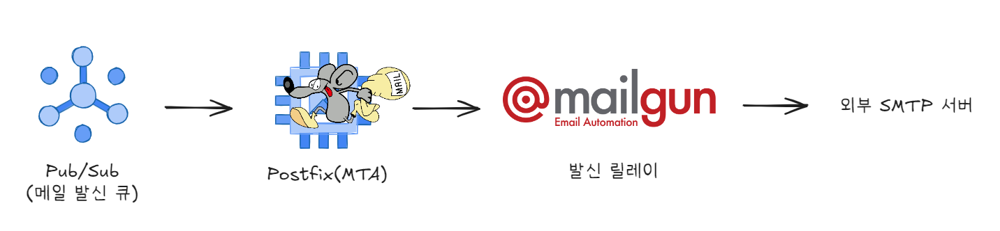
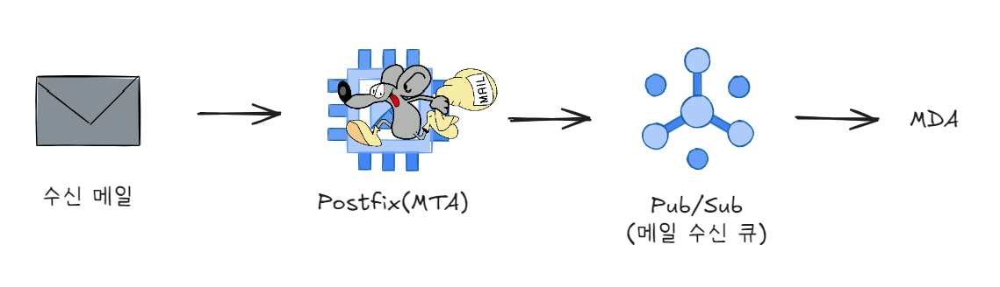

# SMTP: Postfix Deep Dive

> 대량의 구독자에게 정기적으로 메일을 발송하고 수신하는 시나리오를 기반으로, 메일 서버의 핵심인 MTA(Mail Transfer Agent)를 Postfix를 통해 직접 구축하고 동작 원리를 탐구합니다.

## 기술 스택

- Architecture: GCP (Compute Engine, Pub/Sub)
- MTA: Ubuntu, Postfix, Dovecot (SASL), Golang Script

## 아키텍처

### 발신

### 수신

- 느슨한 결합: 각 메일 컴포넌트 간의 결합도를 낮추고 유연성을 확보하기 위해 메시지 큐(Google Cloud Pub/Sub)를 사용했습니다.
- 안정적인 발신: GCP의 25번 포트 아웃바운드 정책을 우회하고 안정적인 메일 발신을 위해 Mailgun을 SMTP 발신 릴레이 서버로 활용합니다.

## 문서

MTA를 구성하며 학습하고 정리한 내용을 각 문서에서 확인하실 수 있습니다.

### 📜 SMTP (RFC 5321)

- [**SMTP Model**](./rfc-5321-smtp/smtp-2.md): SMTP의 기본 구조와 용어 정리
- [**SMTP Procedures**](./rfc-5321-smtp/smtp-3.md): 메일 트랜잭션의 3단계(MAIL, RCPT, DATA) 절차
- [**SMTP Specifications**](./rfc-5321-smtp/smtp-4.md): SMTP 명령어와 응답 코드 명세

### ⚙️ Postfix

- [**Architecture**](./postfix-architecture/postfix-architecture.md): Postfix의 메일 수신 및 전달 과정 아키텍처
- [**Basic Settings**](./postfix-basic/postfix-basic-settings.md): Postfix `main.cf` 설정 파일의 핵심 파라미터 설정

### 🌐 DNS

- [**SPF, DKIM, DMARC**](./dns/spf-dkim-dmarc.md): 스팸 및 위변조 방지를 위한 메일 보안 레코드 설정

### 📤 메일 발신

- [**Submission (MSA)**](./submission/submission.md): 587번 포트를 이용한 메시지 제출 에이전트의 역할
- [**Dovecot (SASL)**](./submission/sasl.md): 587번 submission을 위한 SASL 인증 매커니즘 설정
- [**Mailgun API**](./smtp-api/mailgun.md): 25번 포트 제약 우회 및 SMTP 발신 릴레이 설정
- [**Pub/Sub**](./pub-sub/pub-sub.md): Pub/Sub을 이용한 송수신 파이프라인 구성

### 📥 메일 수신

- [**Mailbox**](./mailbox/mailbox.md): `mbox`와 `maildir` 형식 및 `pipe`를 이용한 메일 처리
